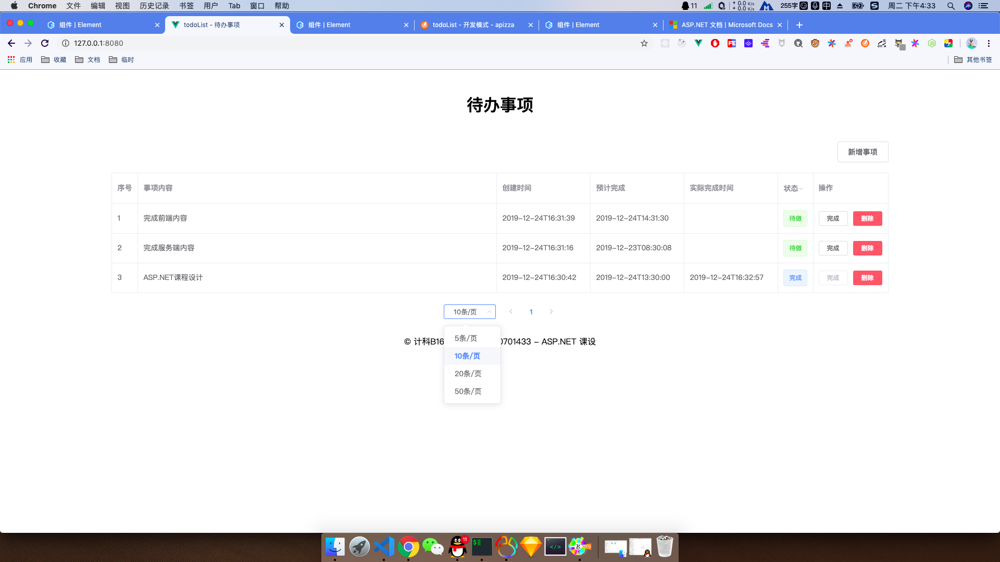

# 基于ASP.NET的ToDoList的设计与实现

## 一. 前言

### (一). 实验目的

使学生综合使用所学过的ASP.NET网络编程知识，掌握网络环境程序设计的基本概念；结合实际的操作和设计，巩固课堂学习内容，掌握网络环境编程的特点、原理和技术；将理论与实际相结合，应用现有的网络编程软件，结合数据库管理系统软件，规范、科学地完成一个小型网站的设计与实现。在此基础上强化学生的实践意识、提高其实际动手能力和创新能力。

### (二). 设备与环境

1. 软件环境

- ASP.NET Core v3.1

- Mysql v8.x

- VUE v2.x

- Element-UI  

- git/github

- NodeJS/npm

- Dotnet

2. 开发环境

- Macbook(苹果系统)

- vscode(安装c#插件)

> 开发环境也可以使用Windows系统，此项目开发时我用的mac环境~

## 二. 项目内容

### (一). 项目简介

基于ASP.NET Core API 和 VUE实现的ToDoList(待办事项)，前后端分离实现（使用RESTFUL规范）

### (二). 项目展示


### (三). 如何运行此项目

1. 克隆本项目: `git clone git@github.com:arleyGuoLei/todoList.git`

- 克隆之后修改`todos-Server/DBConnection.cs`路径下的数据库配置文件，且自行导入sql文件`/todos-Server/todoList.sql`

2. 安装前端依赖/运行前端

```bash
cd todos-fe
npm install # 安装前端依赖
npm run serve # 运行前端项目
```

3. 安装服务端依赖

```bash
cd todos-Server
dotnet restore # 安装服务端依赖
dotnet run # 运行服务端项目
```

## 三. 实验内容

### (一). 数据库相关

1. 数据表结构

```sql
CREATE TABLE `items` (
  `id` int(11) NOT NULL AUTO_INCREMENT,
  `title` varchar(255) CHARACTER SET utf8mb4 COLLATE utf8mb4_0900_ai_ci NOT NULL DEFAULT '' COMMENT '待办事项内容',
  `createTime` datetime NOT NULL COMMENT '创建时间',
  `overTime` datetime DEFAULT NULL COMMENT '实际完成时间',
  `expectTime` datetime DEFAULT NULL COMMENT '预期完成时间',
  `isComplete` enum('true','false') CHARACTER SET utf8mb4 COLLATE utf8mb4_0900_ai_ci NOT NULL DEFAULT 'false' COMMENT '完成状态',
  PRIMARY KEY (`id`) USING BTREE
) ENGINE=InnoDB AUTO_INCREMENT=1 DEFAULT CHARSET=utf8mb4 COLLATE=utf8mb4_0900_ai_ci;
```

2. 数据库操作代码单例封装

详情代码参考`/todos-Server/DBConnection.cs`文件

```csharp
// 连接数据库
string connstring =
    "Server=127.0.0.1;" +
    "Database=todoList;" +
    "User ID=root;" +
    "Password=123456789;";
connection = new MySqlConnection(connstring);
connection.Open();
```

```csharp
// 数据库操作关键语句
DBConnection db = DBConnection.Instance ();
if (db.IsConnect ()) { // 连接数据库
  try {
    string sql = "DELETE FROM todoList.items WHERE id=" + id;
    MySqlCommand cmd = new MySqlCommand (sql, db.Connection);
    MySqlDataReader rdr = cmd.ExecuteReader ();
    rdr.Close ();
  } catch (Exception ex) {
    Console.WriteLine (ex.ToString ());
  }
}
```

### (二). 接口Sql语句

1. 新建待办事项

```csharp
string sql = "INSERT INTO todoList.items (title,expectTime,createTime) VALUES (\"" +
            title + "\",\"" +
            expectTime.ToString ("yyyy-MM-dd HH:mm:ss") + "\",\"" +
            DateTime.Now.ToString ("yyyy-MM-dd HH:mm:ss") + "\")";
          Console.WriteLine ("sql is => " + sql);
```

2. 获取待办事项

```csharp
string sql = "SELECT * FROM todoList.items ORDER BY id DESC LIMIT " + (page - 1) * size + "," + size;
```

3. 完成事项

```csharp
string sql = "UPDATE todoList.items SET isComplete=\"true\", overTime=\""
            + DateTime.Now.ToString ("yyyy-MM-dd HH:mm:ss") + "\""
            + "WHERE id=" + id;
```

4. 删除事项

```csharp
string sql = "DELETE FROM todoList.items WHERE id=" + id;
```

### (三). 难点重点

1. 前后端分离导致的跨域问题

因为浏览器出于安全考虑，有同源策略。也就是说，如果协议、域名或者端口有一个不同就是跨域，Ajax 请求会失败。

那么是出于什么安全考虑才会引入这种机制呢？ 其实主要是用来防止 CSRF 攻击的。简单点说，CSRF 攻击是利用用户的登录态发起恶意请求。

也就是说，没有同源策略的情况下，A 网站可以被任意其他来源的 Ajax 访问到内容。如果你当前 A 网站还存在登录态，那么对方就可以通过 Ajax 获得你的任何信息。当然跨域并不能完全阻止 CSRF。

然后我们来考虑一个问题，请求跨域了，那么请求到底发出去没有？ 请求必然是发出去了，但是浏览器拦截了响应。你可能会疑问明明通过表单的方式可以发起跨域请求，为什么 Ajax 就不会。因为归根结底，跨域是为了阻止用户读取到另一个域名下的内容，Ajax 可以获取响应，浏览器认为这不安全，所以拦截了响应。但是表单并不会获取新的内容，所以可以发起跨域请求。同时也说明了跨域并不能完全阻止 CSRF，因为请求毕竟是发出去了。

#### 解决方法: `CORS`

CORS 需要浏览器和后端同时支持。IE 8 和 9 需要通过 XDomainRequest 来实现。

浏览器会自动进行 CORS 通信，实现 CORS 通信的关键是后端。只要后端实现了 CORS，就实现了跨域。

服务端设置 `Access-Control-Allow-Origin` 就可以开启 CORS。 该属性表示哪些域名可以访问资源，如果设置通配符则表示所有网站都可以访问资源。

C#中通过中间件CORS解决，具体代码如下：

```csharp
// Startup.cs文件

public void ConfigureServices(IServiceCollection services) {
  services.AddCors(option=>option.AddPolicy("cors", policy => policy.AllowAnyHeader().
  AllowAnyMethod().AllowCredentials().WithOrigins(new []{"http://127.0.0.1:8080"})));
}

public void Configure() {
  app.UseCors("cors");
}
```

虽然设置 CORS 和前端没什么关系，但是通过这种方式解决跨域问题的话，会在发送请求时出现两种情况，分别为简单请求和复杂请求。

##### 简单请求

以 Ajax 为例，当满足以下条件时，会触发简单请求

使用下列方法之一：

- GET

- HEAD

- POST

Content-Type 的值仅限于下列三者之一：

- text/plain

- multipart/form-data

- application/x-www-form-urlencoded

请求中的任意 `XMLHttpRequestUpload` 对象均没有注册任何事件监听器； XMLHttpRequestUpload 对象可以使用 XMLHttpRequest.upload 属性访问。

##### 复杂请求

那么很显然，不符合以上条件的请求就肯定是复杂请求了。

对于复杂请求来说，首先会发起一个预检请求，该请求是 option 方法的，通过该请求来知道服务端是否允许跨域请求。

2. 数据列表分页

```csharp
// 服务端使用sql的limit语法进行分页处理
string sql = "SELECT * FROM todoList.items ORDER BY id DESC LIMIT " + (page - 1) * size + "," + size;
// sql is => SELECT * FROM todoList.items ORDER BY id DESC LIMIT 0,20
```

api接口获取列表时传入page和pageSize


前端使用分页组件



服务端返回实例

```json
{
    "sum": 3,
    "list": [
        {
            "id": 3,
            "title": "完成前端内容",
            "isComplete": false,
            "createTime": "2019-12-24T16:31:39",
            "overTime": null,
            "expectTime": "2019-12-24T14:31:30"
        },
        // ...
    ]
}
```

## 四. 实验感悟

经过两周的ASP.NET课程设计，学习了csharp编写服务端代码，更加深入理解了语言的想通性，ASP.NET和NodeJS中有很多相似的概念，比如中间件，控制器，模型等。经过学习C#，感受到了C#作为一门优秀的静态类型语言相比于JavaScript的强势优点，更完善的代码提示和函数跳转等，感受到了JS转typeScript的必要性，使用静态类型语言可以减少代码编写过程中由于粗心造成的BUG，减少拍错时间等。还有，这次课设和同学交流了一些，强烈建议学校课设能使用`git`工具进行项目管理，从大一到大四，课设皆通过`github`托管，到大四的时候，将收获颇多。计算机系的课设文档也建议由`word`转向`markdown`编写，能很快的提高效率，并且markdown是毕业工作之后的必备能力之一。

项目开源地址： [https://github.com/arleyGuoLei/todoList](https://github.com/arleyGuoLei/todoList)

> 文档使用markdown编写，panDoc转换生成word文件。
